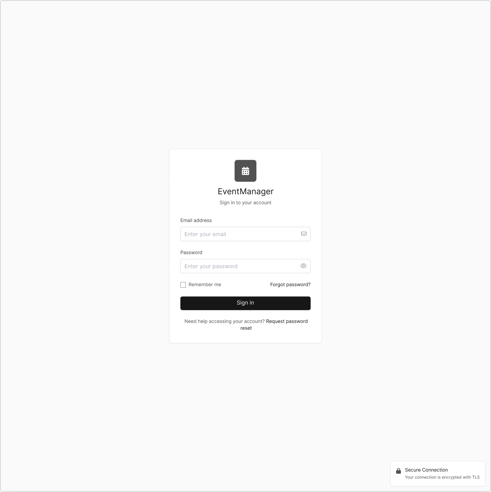
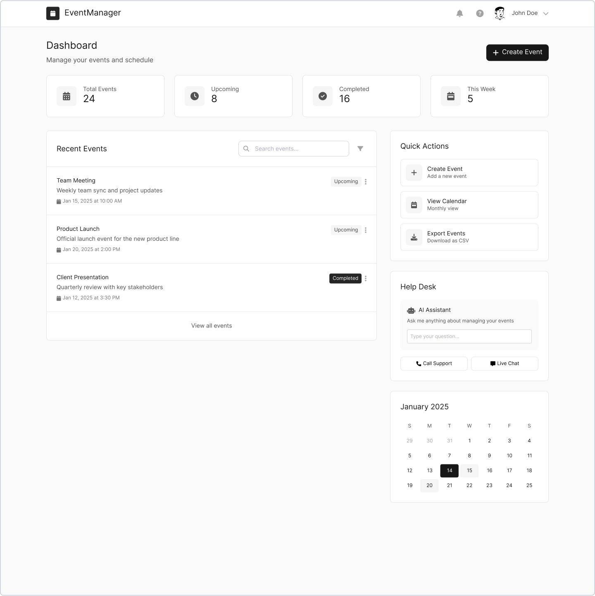
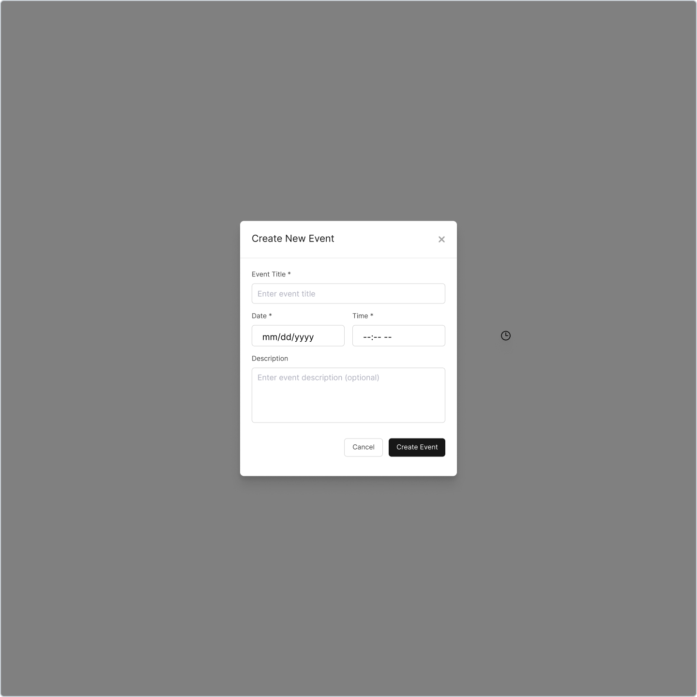
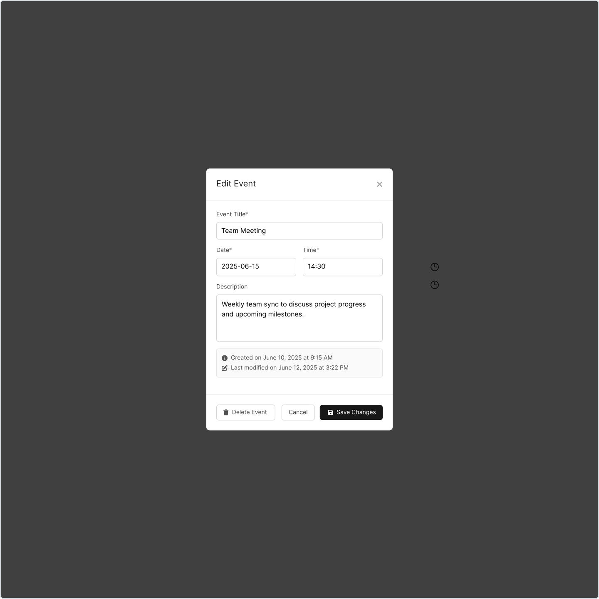
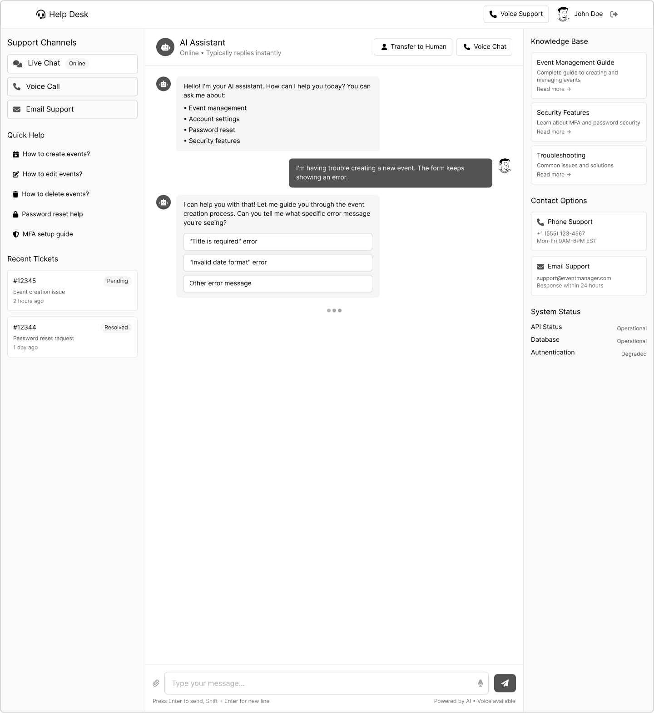

# UCC Event Manager

A secure, modern, multi-user event management platform with integrated helpdesk chatbot and optional voice support. Built for security, scalability, and a seamless user experience.

---

## Table of Contents

- [Overview](#overview)
- [Features](#features)
- [Architecture](#architecture)
- [Technology Stack](#technology-stack)
- [Screenshots & Wireframes](#screenshots--wireframes)
- [Project Structure](#project-structure)
- [Quick Start](#quick-start)
- [Configuration](#configuration)
- [API Overview](#api-overview)
- [Security](#security)
- [Development & Testing](#development--testing)
- [Contributing](#contributing)
- [License](#license)
- [Acknowledgements](#acknowledgements)

---

## Overview

**UCC Event Manager** is a full-stack web application for managing personal events, featuring robust authentication (OAuth2, JWT, MFA), a helpdesk chatbot (with escalation and voice support), and enterprise-grade security. The system is designed for both end-users and administrators, with a focus on usability, compliance, and extensibility.

---

## Features

- **User Authentication:** OAuth2.0, JWT, optional MFA (TOTP), secure password reset
- **Event Management:** Create, view, update, and delete personal events
- **Helpdesk Chatbot:** Integrated Rasa-powered chatbot with escalation to human agents
- **Voice Helpdesk:** (Bonus) Voice-based support via Twilio or Web Speech API
- **Security:** Rate limiting, brute-force protection, encrypted storage, OWASP Top 10 mitigations
- **Admin Tools:** (Planned) User management, audit logs, system monitoring
- **Responsive UI:** Modern, accessible, and mobile-friendly interface

---

## Architecture

```
+-------------------+        HTTPS        +-------------------+        SQL/TCP        +-------------------+
|    Frontend SPA   | <----------------> |     Backend API   | <------------------> |    PostgreSQL DB  |
|   (Vue 3 + Vite)  |                    |   (FastAPI/Python)|                     | (Encrypted at rest)|
+-------------------+                    +-------------------+                     +-------------------+
         |                                        |
         |                                        | HTTP
         |                                        v
         |                              +-------------------+
         |                              |   Rasa Chatbot    |
         |                              +-------------------+
         |                                        |
         |                                        | Webhook
         |                                        v
         |                              +-------------------+
         |                              |  Twilio/Web Voice |
         |                              +-------------------+
```

- **Frontend:** Vue 3 SPA (Vite, Pinia, Tailwind CSS)
- **Backend:** FastAPI (Python 3.11+), PostgreSQL, Redis, Rasa chatbot, optional Twilio/Web Speech
- **DevOps:** Docker Compose, Nginx (TLS, reverse proxy), CI/CD ready

---

## Technology Stack

**Frontend:**
- Vue 3, Vite, TypeScript, Pinia, Vue Router, Tailwind CSS, Headless UI, Heroicons, Axios, Cypress, Vitest

**Backend:**
- FastAPI, Uvicorn, SQLAlchemy, Alembic, PostgreSQL, Redis, Pydantic, Passlib, PyJWT, PyOTP, slowapi, aiosmtplib, Rasa, Twilio (optional), Docker

**DevOps:**
- Docker Compose, Nginx, Poetry, GitHub Actions

See [`docs/tech-stack.md`](docs/tech-stack.md) for full details.

---

## Screenshots & Wireframes








*(See more in [`docs/wireframes/`](docs/wireframes/))*

---

## Project Structure

```
.
├── backend/      # FastAPI backend, database, Rasa, migrations, tests
├── frontend/     # Vue 3 SPA, static assets, Cypress tests
├── nginx/        # Nginx config for TLS, reverse proxy
├── docs/         # Architecture, tech stack, API specs, wireframes
├── docker-compose.yml
├── prod.env.example
└── README.md
```

---

## Quick Start

### Prerequisites

- Docker & Docker Compose
- (For local dev: Python 3.11+, Node.js 18+)

### 1. Clone the repository

```bash
git clone <repo-url>
cd ucc-event-manager
```

### 2. Configure environment

```bash
cp prod.env.example .env
# Edit .env with your secrets and config
```

### 3. Start all services

```bash
docker-compose up --build
```

- Frontend: [https://localhost](https://localhost)
- Backend API: [https://localhost/api/v1/docs](https://localhost/api/v1/docs)
- Rasa Chatbot: [http://localhost:5005](http://localhost:5005)

### 4. Run database migrations

```bash
docker-compose exec backend alembic upgrade head
```

### 5. Access the app

Open [https://localhost](https://localhost) in your browser

---

## Configuration

- All environment variables are documented in [`prod.env.example`](prod.env.example)
- Secrets (JWT keys, DB passwords) **must** be set securely in production

---

## API Overview

- Full OpenAPI docs: `/api/v1/docs`
- See [`docs/api-specs.md`](docs/api-specs.md) for detailed endpoints

**Key Endpoints:**
- `POST /api/v1/auth/token` - Login
- `POST /api/v1/auth/password-reset/request` - Request password reset
- `GET /api/v1/events` - List events
- `POST /api/v1/events` - Create event
- `POST /api/v1/helpdesk/chat` - Chatbot query

---

## Security

- **HTTPS everywhere** (Nginx reverse proxy)
- **OAuth2.0 + JWT** for all API access
- **MFA (TOTP)** for users who enable it
- **Password reset tokens:** single-use, time-limited, hashed
- **Passwords:** bcrypt/argon2, salted
- **Database encryption at rest**
- **Input validation, rate limiting, CORS**
- **No sensitive data in logs**
- **OWASP Top 10 mitigations**

See [`docs/security.md`](docs/security.md) for details.

---

## Development & Testing

### Backend

```bash
cd backend
poetry install
poetry shell
uvicorn app.main:app --reload
pytest
```

### Frontend

```bash
cd frontend
npm install
npm run dev
npm run test:unit
npm run test:e2e:dev
```

---

## Contributing

1. Fork the repo and create a feature branch
2. Follow code style and security guidelines
3. Submit a pull request with a clear description

---

## License

This project is licensed under the MIT License. See [LICENSE](LICENSE) for details.

---

## Acknowledgements

- [FastAPI](https://fastapi.tiangolo.com/)
- [Vue.js](https://vuejs.org/)
- [Rasa](https://rasa.com/)
- [Tailwind CSS](https://tailwindcss.com/)
- [Docker](https://www.docker.com/)
- [OWASP](https://owasp.org/)

---

For more details, see the [`docs/`](docs/) directory.